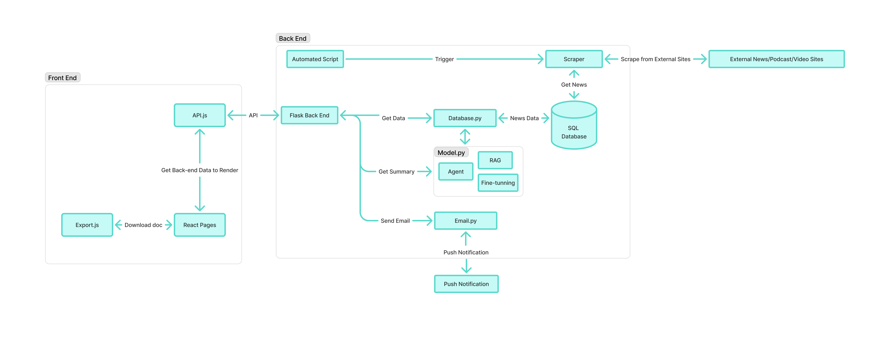
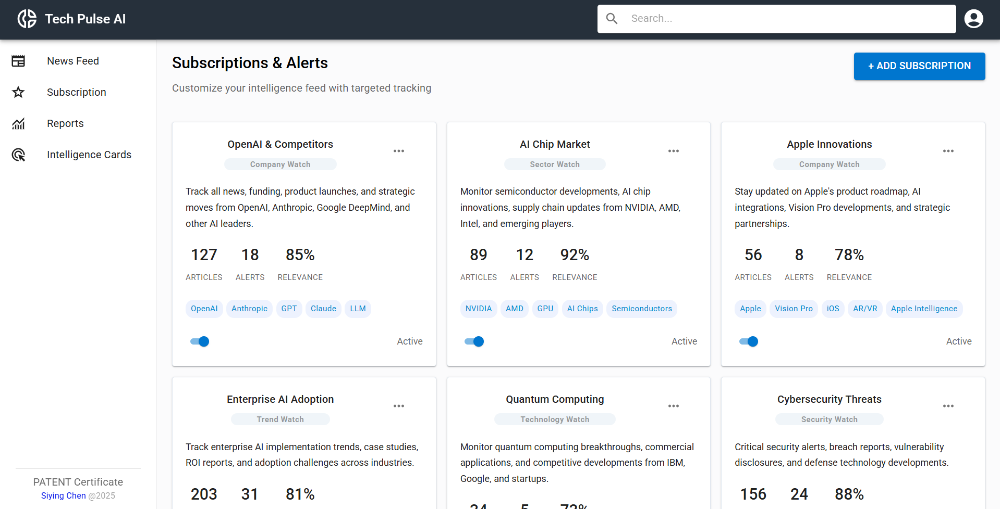
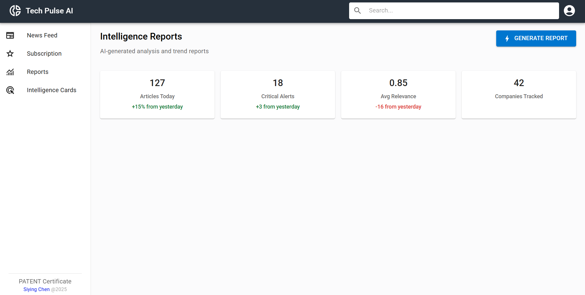

# TechPulse AI: Strategic Intelligence Assistant Chatbot

## Overview
TechPulse AI is an AI-powered chatbot designed for the CEO office of technology companies. Its core purpose is to provide daily strategic intelligence on tech news by automatically tracking, summarizing, and generating insights. This helps strategic analysts and decision-makers stay informed with real-time information for faster, smarter decisions.



## Demo
Manage your subscription!


Keep track of your news gallery!


Find your ideal news items!


## Who is it for?
CEOs and Executive Assistants
Strategic and Investment Analysts
Market Researchers
Product and Technology Decision-makers

## Key Features
TechPulse AI helps you cut through information overload and get to the insights that matter:
Multi-Source News Aggregation: Gathers news from top tech sources like TechCrunch, WIRED, MIT Tech Review, and more, supporting multiple languages (primarily English & Chinese).
LLM-Powered Daily Summaries: Uses advanced AI models (like GPT/Claude hybrids) to summarize news, extract key entities, and assign a "Strategic Impact Score" to each item.
Interactive Chat-Based Q&A: Ask natural language questions (e.g., "What did Apple announce today?") and get source-grounded answers with reference links.
Custom Subscriptions & Alerts: Personalize your news feed by company, technology, region, or sector, and receive alerts on high-impact events.
Auto-Generated Reports: Get structured weekly or monthly reports (slides/PDFs) with graphs, trend maps, and sentiment charts, ready for executive briefings.
Intelligence Cards: Each news item is converted into a concise "card" with background, strategic impact, competitive context, and suggested actions, perfect for sharing and bookmarking.

## How it Helps You
Saves Time: Smart aggregation and concise summaries reduce reading time by up to 80%.
Targeted Monitoring: Easily track competitors and topics with intelligent filtering and alerts.
Deeper Insights: AI-driven analysis provides cross-source trend analysis that manual tracking can miss.
Streamlined Reporting: Automated report generation eliminates fragmented data and inconsistent formats.

## Technical Highlights
The system leverages cutting-edge AI and data processing technologies:
News Aggregation: Uses tools like Scrapy, Playwright, and RSS/API integrations.
LLM & RAG: Powered by models like GPT-4-turbo and Claude 3 Opus, with Retrieval-Augmented Generation (RAG) for accurate, grounded responses.
Data Processing: Employs embedding-based clustering and fingerprinting for deduplication.
Security: Designed with enterprise-grade security, including OAuth/SSO and GDPR compliance.

## Getting Started
To run the news aggregation script (as provided separately), ensure you have the necessary Python dependencies installed from the requirements.txt file.

```
npm run setup // script to install all packages
npm start
// ctrl + c to stop
```

## Tools
 - Front end: Javascript, React, MUI, RESTful API
 - Back end: Python Flask, Beautifulsoup, Selenium, RESTful API

## Responsibilities
 - Front end design: Siying
 - Front end development: Yichen
 - Back end design & development: Siying